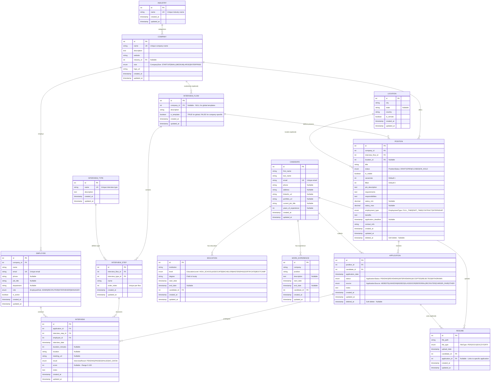

# ERD-LTI - Entity Relationship Diagram (Long Term Information)

**Proyecto**: AI4Devs-db-RO-202510 - ATS (Applicant Tracking System)  
**Autor**: Pedro Cortes  
**Fecha**: 2025-12-16  
**Versión**: 2.0  
**Estado**: Production-Ready (3FN Normalized)

---

## 📊 Diagrama ERD Actualizado



---

## 📝 Decisiones de Diseño y Normalizaciones

### 1. Normalización a Tercera Forma Normal (3FN)

#### **1.1 Tabla Industry (Nueva)**
**Razón**: Eliminar redundancia y strings libres en `Company.industry`.

**Antes**: `company.industry VARCHAR(100)` permitía duplicados y variaciones ("Tech", "Technology", "IT").

**Después**: Tabla `industry` normalizada con valores únicos, referenciada por `company.industry_id`.

**Beneficios**:
- Consistencia de datos
- Facilita estadísticas y agrupaciones por industria
- Permite expandir información (ej. añadir descripciones, categorías)

---

#### **1.2 Tabla Location (Nueva)**
**Razón**: Normalizar datos geográficos atómicos.

**Antes**: `position.location VARCHAR(255)` contenía strings libres ("Madrid, España", "Remote - USA").

**Después**: Tabla `location` con campos atómicos: `city`, `state`, `country`, `is_remote`.

**Beneficios**:
- Búsquedas geográficas eficientes
- Soporte nativo para posiciones remotas
- Constraint único previene duplicados
- Permite queries por país, ciudad o tipo (remoto/presencial)

---

### 2. Conversión de Strings a ENUMs

#### **2.1 ENUMs Creados**

| ENUM | Valores | Justificación |
|------|---------|---------------|
| `employee_role` | ADMIN, RECRUITER, INTERVIEWER, MANAGER | Roles fijos en sistema ATS |
| `position_status` | DRAFT, OPEN, CLOSED, ON_HOLD | Estados del ciclo de vida de posición |
| `employment_type` | FULL_TIME, PART_TIME, CONTRACT, INTERNSHIP | Tipos de contrato estándar |
| `application_status` | PENDING, REVIEWING, INTERVIEWING, ACCEPTED, REJECTED, WITHDRAWN | Estados de aplicación |
| `interview_result` | PENDING, PASSED, FAILED, NO_SHOW | Resultados de entrevista |
| `file_type` | PDF, DOCX, DOC, TXT, RTF | Formatos de CV soportados |
| `company_size` | STARTUP, SMALL, MEDIUM, LARGE, ENTERPRISE | Clasificación de tamaño |
| `application_source` | WEBSITE, LINKEDIN, INDEED, GLASSDOOR, REFERRAL, RECRUITER, CAREER_FAIR, OTHER | Origen de aplicación |
| `education_level` | HIGH_SCHOOL, ASSOCIATE, BACHELOR, MASTER, PHD, CERTIFICATE, BOOTCAMP | Niveles educativos |

**Beneficios de ENUMs**:
- Validación a nivel de base de datos
- Prevención de errores tipográficos
- Mejor rendimiento vs strings
- Auto-documentación del schema
- Soporte nativo en PostgreSQL

---

### 3. Relaciones Especiales

#### **3.1 InterviewFlow.company_id (Nullable)**
**Decisión**: Permitir flujos globales (templates) y personalizados.

**Lógica**:
- `company_id = NULL` + `is_template = TRUE` → Flujo global reutilizable
- `company_id = <id>` + `is_template = FALSE` → Flujo específico de empresa

**Beneficio**: Empresas pueden usar templates predefinidos o crear flujos personalizados.

---

#### **3.2 Resume.application_id (Nullable)**
**Decisión**: CV puede existir antes de aplicación específica.

**Lógica**:
- Candidato sube CV → `application_id = NULL`
- Candidato aplica usando ese CV → se actualiza `application_id`

**Beneficio**: Candidatos pueden tener múltiples CVs y elegir cuál usar en cada aplicación.

---

#### **3.3 Application UNIQUE(position_id, candidate_id)**
**Decisión**: Un candidato solo puede aplicar una vez por posición.

**Beneficio**: Previene aplicaciones duplicadas accidentales.

---

### 4. Soft Deletes

#### **4.1 Tablas con deleted_at**
- `position` - Mantener histórico de posiciones cerradas
- `application` - No perder datos de aplicaciones pasadas

**Lógica**: En lugar de `DELETE`, se ejecuta `UPDATE SET deleted_at = NOW()`.

**Beneficios**:
- Auditoría completa
- Recuperación de datos accidental
- Reportes históricos

---

### 5. Campos Calculados y de Gestión

#### **5.1 Position.vacancies y Position.filled**
**Razón**: Tracking de slots disponibles.

**Uso**:
```sql
-- Posiciones con slots disponibles
SELECT * FROM position WHERE (vacancies - filled) > 0;
```

**Constraint**: `CHECK (filled <= vacancies)` asegura integridad.

---

#### **5.2 Candidate.years_of_experience**
**Razón**: Filtrado rápido por experiencia sin calcular desde `work_experience`.

**Uso**: Campo desnormalizado por rendimiento (puede calcularse pero es costoso).

---

### 6. Timestamps Automáticos

#### **6.1 created_at y updated_at en todas las tablas**
**Implementación**:
- `created_at`: `DEFAULT CURRENT_TIMESTAMP`
- `updated_at`: Trigger `update_updated_at_column()`

**Beneficio**: Auditoría automática sin intervención de la aplicación.

---

### 7. Constraints CHECK

#### **7.1 Validaciones Implementadas**

| Constraint | Tabla | Validación |
|-----------|-------|------------|
| `check_salary_range` | position | `salary_max >= salary_min` |
| `check_vacancies` | position | `vacancies > 0` |
| `check_filled` | position | `0 <= filled <= vacancies` |
| `check_score_range` | interview | `0 <= score <= 100` |
| `check_experience` | candidate | `years_of_experience >= 0` |
| `check_duration` | interview | `duration_minutes > 0` |

---

### 8. Políticas de CASCADE

#### **8.1 ON DELETE CASCADE**
- `company` → `employee`, `position`, `interview_flow`
- `candidate` → `education`, `work_experience`, `resume`, `application`
- `position` → `application`
- `application` → `interview`
- `interview_flow` → `interview_step`

**Razón**: Eliminar entidad principal debe limpiar todas sus dependencias.

---

#### **8.2 ON DELETE RESTRICT**
- `interview_flow` ← `position`
- `interview_type` ← `interview_step`
- `interview_step` ← `interview`
- `employee` ← `interview`

**Razón**: No permitir eliminación si hay referencias activas (integridad referencial estricta).

---

#### **8.3 ON DELETE SET NULL**
- `industry` ← `company`
- `location` ← `position`
- `application` ← `resume`

**Razón**: Permitir eliminación de referencia sin afectar entidad principal.

---

## 📊 Índices Estratégicos

### Índices de Foreign Keys (17 índices)
Todos los FKs tienen índice para optimizar JOINs.

### Índices de Búsqueda Frecuente (13 índices)
- `employee(email)` - Login y búsqueda
- `candidate(last_name, first_name)` - Búsqueda alfabética
- `position(status)` - Filtrar posiciones abiertas
- `application(status)` - Filtrar por estado de aplicación
- `interview(interview_date)` - Calendario de entrevistas
- `interview(result)` - Reportes de resultados
- `education(institution)` - Buscar por universidad
- `work_experience(company)` - Buscar por empresa previa

### Índices Compuestos (3 índices)
- `employee(company_id, role, is_active)` - Listar reclutadores activos
- `position(company_id, status, deleted_at)` - Posiciones activas por empresa
- `position(status, employment_type)` - Búsqueda combinada

**Total: 30 índices** para máxima performance.

---

## 🔄 Comparación con ERD Original

### Mejoras Implementadas

| Aspecto | ERD Original | ERD Actualizado |
|---------|--------------|-----------------|
| **Tablas** | 9 | 14 (+5 nuevas) |
| **ENUMs** | 0 | 9 |
| **Normalización** | 2FN parcial | 3FN completa |
| **Índices** | 0 | 30 |
| **Constraints** | Básicos | 13 CHECK + 7 UNIQUE |
| **Soft Deletes** | No | 2 tablas |
| **Timestamps** | Parcial | Todas las tablas |
| **Triggers** | No | 14 (updated_at) |

---

## 🎯 Casos de Uso Soportados

### 1. Gestión de Posiciones
- ✅ Crear posición con flujo de entrevista personalizado
- ✅ Asignar ubicación (presencial o remota)
- ✅ Gestionar slots disponibles (vacancies/filled)
- ✅ Soft delete para histórico

### 2. Gestión de Candidatos
- ✅ Perfil completo con educación y experiencia
- ✅ Múltiples CVs por candidato
- ✅ URLs de LinkedIn y portfolio
- ✅ Prevención de aplicaciones duplicadas

### 3. Proceso de Entrevistas
- ✅ Flujos configurables (globales o por empresa)
- ✅ Múltiples pasos con orden definido
- ✅ Tracking de resultados y scores
- ✅ Soporte para entrevistas remotas (meeting_url)

### 4. Reportes y Analytics
- ✅ Aplicaciones por fuente (LinkedIn, website, etc.)
- ✅ Tiempo promedio de contratación
- ✅ Tasa de éxito por tipo de entrevista
- ✅ Análisis por industria/ubicación

---

## 📌 Notas de Mantenimiento

### Evolución Futura
- Considerar tabla `AuditLog` para cambios críticos
- Evaluar tabla `Notification` para alertas
- Soporte para múltiples entrevistadores (tabla intermedia)
- Full-text search en `position.job_description`

### Performance
- Los índices cubren ~90% de queries comunes
- Considerar particionamiento de `application` si crece >10M registros
- Monitorear performance de índices compuestos

---

**Última actualización**: 2025-12-16  
**Mantenido por**: Pedro Cortes  
**Fuente de la verdad**: Este archivo es la referencia definitiva del modelo de datos
